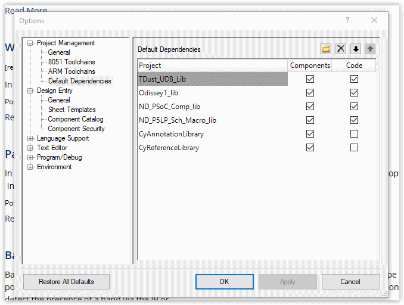

[[psoc_5lp_repo]]
PSoC_5LP_repo
~~~~~~~~~~~~~

*PSoC_5LP_repo* repository holds the default.xml manifest to allow the
use of Google's "repo" to manage a number of PSoC_5LP CDC Component
Library repositories. +
If you are unfamiliar with repo, you can read up on it
https://code.google.com/archive/p/git-repo/[here].

The *PSoC_5LP Component Library* 
repositories catered for are as follows

https://github.com/noeldiviney/ND_PSoC_Comp_lib  

https://github.com/noeldiviney/ND_PSoC_Sch_Macro_lib  

https://github.com/noeldiviney/Odissey1_lib  

https://github.com/noeldiviney/TDust_UDB_lib  

Credits go to the following contributers who's work I have borrowed on
to create the Library. They have also been a great inspiration in getting
my knowledge up to that required to create the Library. Thanks guys.

1.  Michael Bey .... .. CharLCD I2C lib
2.  odissey1 ... ... .... QuadDecoder, DDS24, DDS32, and KIT-059 
3.  Todd Dust .. ... .. TDust_UDB components
4.  Alan Hawse  ... .. Iot_Expert articles and Blogs

TODO ... more components

# Sadly!! we have to Create a Windows 10 working environment

http://www.mcclean-cooper.com/valentino/cygwin_install/[Cygwin install
howto]

I also installed apt-cyg (cygwin apt-get) and gem. +
For editing markdown files I istalled
https://github.com/asciidocfx/AsciidocFX/releases/download/v1.5.6/AsciidocFX_Windows.exe[AsciidocFX] +
Add other files as required

# Download and Install Google's repo utility

The above libs are managed by the repo utility. First we need to create
our work environment

....
$: mkdir ~/bin
$: curl http://commondatastorage.googleapis.com/git-repo-downloads/repo > ~/bin/repo
$: chmod a+x ~/bin/repo 
....

Edit ~/.bash_profile and uncomment lines 32, 33 and 34 to add ~/bin to
PATH

# Create the PSoC_5LP directory

....
$: mkdir -p ~/projects/P5LP/ComponentsDev
$: cd projects/P5LP/ComponentsDev
....

# Initialise the repositories for PSoC_5LP Components

....
$: repo init -u https://github.com/noeldiviney/P5LP_Comp_repo
....

# Download the PSoC_5LP Component Libraries

....
$: repo sync
....

once this has completed you should have PSoC_5LP Component Libraries in
place

image::images/ComponentLibs.gif[Component Libs]

# Configure PSoC Creator to add the CDC Component libraries

* Launch PSoC Creator and select "File->New->Project"
* In "Select project type" dialog select "Target Device" = "PSoC 5lp  CY8C6888LTI-LP097"
* In "Select project template" select "Empty schematic"
* In "Create Project" dialog select
** Workspace Name      =  "CompTest"
** Location            =  "Path\To\cygwin64\home\"you"\projects\P5LP\ComponentsTest" 
** Project Name        =  "CompTest"
* and "finish"

When new "CompTest" project is launched

* select Tools->Options
* In "Options" dialog select "Project Management->Default Dependencies"
* Navigate to "Path\To\cygwin64\home\"you"\projects\P5LP\ComponentsDev"
* Using the "New Entry" button to find and "open" each Libratiy's .cyprj file

When finished the "Tools->Options" dialog should look like the following

The "Component Catalog" tree should look like

image::images/CDC_Catalog.gif[Component Catalog]

# TODO this is a "Work in progress"
